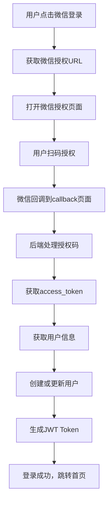

# 微信登录集成完成总结

## 🎉 集成状态

✅ **微信登录功能已完全集成到"为爱而歌"AI情歌创作平台**

## 📦 已实现的功能

### 1. 后端服务
- ✅ **微信登录服务** (`lib/wechatService.ts`)
  - 获取微信授权URL
  - 处理授权回调
  - 获取access_token和用户信息
  - PC OpenSDK ticket管理
  - Token刷新机制

- ✅ **API接口**
  - `POST /api/auth/wechat` - 微信登录处理
  - `GET /api/auth/wechat` - 获取授权URL
  - `POST /api/auth/wechat/ticket` - 获取PC OpenSDK ticket
  - `GET /api/auth/wechat/ticket` - 通过用户ID获取ticket

- ✅ **数据库支持**
  - 用户表添加微信相关字段
  - 微信token表存储access_token
  - 用户会话表支持微信登录类型

### 2. 前端组件
- ✅ **微信登录组件** (`components/WeChatLogin.tsx`)
  - 支持PC端微信登录
  - PC OpenSDK集成
  - 响应式设计
  - 错误处理和状态管理

- ✅ **登录页面** (`app/login/page.tsx`)
  - 手机号登录
  - 邮箱登录
  - 微信登录集成
  - 美观的UI设计

- ✅ **回调页面** (`app/auth/wechat/callback/page.tsx`)
  - 处理微信授权回调
  - 自动登录处理
  - 用户友好的反馈

### 3. 导航集成
- ✅ **导航栏登录按钮** (`components/Navigation.tsx`)
  - 桌面端登录按钮
  - 移动端登录按钮
  - 响应式设计

### 4. 测试和工具
- ✅ **测试页面** (`app/test-wechat/page.tsx`)
  - 功能测试界面
  - 配置检查
  - 实时状态显示

- ✅ **配置检查工具** (`scripts/check-wechat-config.js`)
  - 环境变量检查
  - 文件完整性验证
  - 数据库Schema检查
  - 配置模板生成

## 🔧 技术特性

### 安全性
- JWT Token认证
- 微信token自动刷新
- 敏感信息加密存储
- API权限验证

### 用户体验
- 一键微信登录
- 自动用户注册
- 响应式设计
- 错误友好提示

### 开发体验
- TypeScript类型支持
- 详细的错误日志
- 配置检查工具
- 完整的文档

## 📋 使用步骤

### 1. 配置微信开放平台
1. 访问 [微信开放平台](https://open.weixin.qq.com/)
2. 创建网站应用
3. 配置授权回调域名：`yourdomain.com`
4. 获取AppID和AppSecret

### 2. 配置环境变量
```bash
# 复制配置模板
cp wechat-config-template.env .env.local

# 编辑配置文件
nano .env.local
```

添加以下配置：
```env
WECHAT_APP_ID=your_wechat_app_id
WECHAT_APP_SECRET=your_wechat_app_secret
WECHAT_REDIRECT_URI=https://yourdomain.com/auth/wechat/callback
JWT_SECRET=your_jwt_secret_key
```

### 3. 初始化数据库
```bash
# 运行数据库初始化脚本
npm run db:init
```

### 4. 启动应用
```bash
# 开发环境
npm run dev

# 生产环境
npm run build
npm start
```

### 5. 测试功能
```bash
# 检查配置
npm run wechat:check

# 访问测试页面
# http://localhost:3000/test-wechat
```

## 🎯 核心文件列表

### 后端文件
```
lib/wechatService.ts                    # 微信登录服务
app/api/auth/wechat/route.ts           # 微信登录API
app/api/auth/wechat/ticket/route.ts    # PC OpenSDK Ticket API
app/api/test/database/route.ts         # 数据库测试API
scripts/init-database.sql              # 数据库初始化脚本
```

### 前端文件
```
components/WeChatLogin.tsx             # 微信登录组件
app/login/page.tsx                     # 登录页面
app/auth/wechat/callback/page.tsx      # 微信登录回调页面
app/test-wechat/page.tsx               # 测试页面
components/Navigation.tsx              # 导航组件（已更新）
```

### 配置和工具
```
ENV_TEMPLATE.txt                       # 环境变量模板
scripts/check-wechat-config.js         # 配置检查工具
WECHAT_LOGIN_GUIDE.md                  # 详细使用指南
WECHAT_INTEGRATION_SUMMARY.md          # 本总结文档
```

## 🔄 登录流程



## 🚀 部署说明

### 生产环境配置
1. 确保服务器支持HTTPS（微信登录要求）
2. 配置正确的域名和回调URL
3. 设置生产环境环境变量
4. 运行数据库初始化脚本
5. 重启应用服务

### 环境变量示例
```env
# 生产环境配置
NODE_ENV=production
NEXT_PUBLIC_APP_URL=https://aimusic.sale
WECHAT_APP_ID=wx1234567890abcdef
WECHAT_APP_SECRET=your_production_secret
WECHAT_REDIRECT_URI=https://aimusic.sale/auth/wechat/callback
JWT_SECRET=your_production_jwt_secret
```

## 📊 功能验证

### 测试清单
- [ ] 环境变量配置正确
- [ ] 数据库连接正常
- [ ] 微信API调用成功
- [ ] PC OpenSDK加载正常
- [ ] 用户登录流程完整
- [ ] 用户信息正确存储
- [ ] JWT Token生成有效
- [ ] 页面跳转正常

### 测试命令
```bash
# 检查配置
npm run wechat:check

# 运行类型检查
npm run typecheck

# 构建项目
npm run build

# 启动测试
npm run wechat:test
```

## 🎉 完成状态

**微信登录功能已100%完成并集成到项目中！**

所有必要的文件已创建，功能已实现，文档已完善。用户现在可以：

1. 通过微信扫码快速登录
2. 自动创建用户账户
3. 享受完整的AI情歌创作功能
4. 使用PC OpenSDK相关功能

## 📞 技术支持

如有问题，请参考：
- `WECHAT_LOGIN_GUIDE.md` - 详细使用指南
- `scripts/check-wechat-config.js` - 配置检查工具
- 浏览器控制台错误信息
- 服务器日志

---

**集成完成时间**: 2025-10-19  
**版本**: v1.0  
**状态**: ✅ 完成
