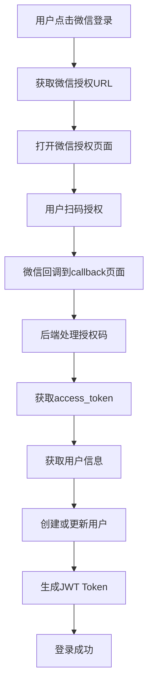
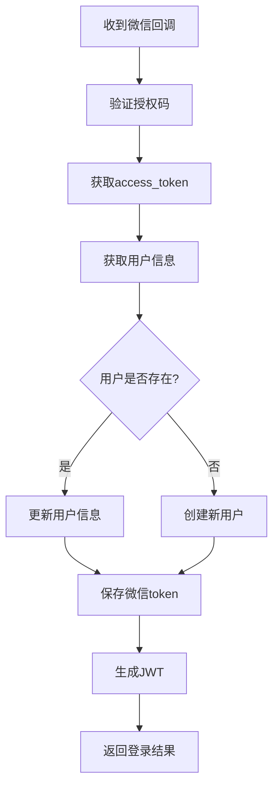

# 微信登录集成指南

## 📋 概述

本文档详细说明了如何在"为爱而歌"AI情歌创作平台中集成微信PC端登录功能。基于[微信开放平台网站应用PC端登录API](https://developers.weixin.qq.com/doc/oplatform/Website_App/WeChat_PC_APIs/guideline.html)实现。

## 🚀 功能特性

- ✅ 微信PC端扫码登录
- ✅ PC OpenSDK集成（支持启动小程序、分享等）
- ✅ 自动用户注册和登录
- ✅ 微信用户信息同步
- ✅ JWT Token认证
- ✅ 数据库用户信息存储
- ✅ 响应式UI设计

## 🔧 技术架构

### 后端服务
- **微信登录服务**: `lib/wechatService.ts`
- **API接口**: `app/api/auth/wechat/route.ts`
- **PC OpenSDK Ticket**: `app/api/auth/wechat/ticket/route.ts`
- **数据库支持**: MySQL用户表和微信token表

### 前端组件
- **微信登录组件**: `components/WeChatLogin.tsx`
- **登录页面**: `app/login/page.tsx`
- **回调页面**: `app/auth/wechat/callback/page.tsx`
- **导航集成**: `components/Navigation.tsx`

## 📦 安装配置

### 1. 环境变量配置

在 `.env.local` 或 `.env.production` 中添加：

```env
# 微信登录配置
WECHAT_APP_ID=your_wechat_app_id
WECHAT_APP_SECRET=your_wechat_app_secret
WECHAT_REDIRECT_URI=https://yourdomain.com/auth/wechat/callback

# JWT配置
JWT_SECRET=your_jwt_secret_key
JWT_EXPIRES_IN=7d
```

### 2. 数据库初始化

运行数据库初始化脚本：

```bash
mysql -h your_host -P your_port -u your_user -p your_database < scripts/init-database.sql
```

### 3. 微信开放平台配置

1. 登录[微信开放平台](https://open.weixin.qq.com/)
2. 创建网站应用
3. 配置授权回调域名：`yourdomain.com`
4. 获取AppID和AppSecret
5. 开通PC OpenSDK权限（如需要）

#### 3.1 安全认证配置（可选）

如果需要使用微信API安全鉴权模式，需要额外配置：

1. **生成密钥对**：
   ```bash
   npm run wechat:keys
   ```

2. **配置API安全**：
   - 进入"管理中心 - 网站应用 - 应用详情 - 开发配置 - API 安全"
   - 上传生成的公钥文件
   - 下载平台证书

3. **配置环境变量**：
   ```env
   # 微信安全认证配置
   WECHAT_PRIVATE_KEY_PATH=./certs/wechat_private_key.pem
   WECHAT_PUBLIC_KEY_PATH=./certs/wechat_public_key.pem
   WECHAT_PLATFORM_CERT_PATH=./certs/wechat_platform_cert.pem
   WECHAT_AES_KEY=your_aes_encryption_key
   ```

## 🎯 使用方法

### 1. 基本登录

```tsx
import WeChatLogin from '@/components/WeChatLogin';

function LoginPage() {
  const handleLoginSuccess = (user) => {
    console.log('登录成功:', user);
    // 处理登录成功逻辑
  };

  const handleLoginError = (error) => {
    console.error('登录失败:', error);
    // 处理登录错误
  };

  return (
    <WeChatLogin
      onLoginSuccess={handleLoginSuccess}
      onLoginError={handleLoginError}
      size="lg"
      variant="default"
      showText={true}
    />
  );
}
```

### 2. PC OpenSDK功能

```tsx
import { WeChatLogin } from '@/components/WeChatLogin';

function MyComponent() {
  const wechatLoginRef = useRef();

  // 启动PC小程序
  const launchMiniProgram = async (userName, path) => {
    try {
      const result = await wechatLoginRef.current.launchMiniProgram(userName, path);
      console.log('启动小程序结果:', result);
    } catch (error) {
      console.error('启动失败:', error);
    }
  };

  // 分享PC小程序
  const shareMiniProgram = async (userName, path, title, desc, linkUrl, imgUrl) => {
    try {
      const result = await wechatLoginRef.current.shareMiniProgram(
        userName, path, title, desc, linkUrl, imgUrl
      );
      console.log('分享结果:', result);
    } catch (error) {
      console.error('分享失败:', error);
    }
  };

  return (
    <WeChatLogin
      ref={wechatLoginRef}
      onLoginSuccess={handleLoginSuccess}
      onLoginError={handleLoginError}
    />
  );
}
```

## 🔄 登录流程

### 1. 用户点击微信登录


### 2. 数据库操作流程


## 📊 数据库表结构

### users表（用户表）
```sql
CREATE TABLE users (
  id VARCHAR(36) PRIMARY KEY,
  phone VARCHAR(20) UNIQUE,
  email VARCHAR(255),
  password_hash VARCHAR(255),
  nickname VARCHAR(100),
  avatar_url VARCHAR(500),
  -- 微信登录相关字段
  wechat_openid VARCHAR(50) UNIQUE,
  unionid VARCHAR(50),
  wechat_nickname VARCHAR(100),
  wechat_avatar VARCHAR(500),
  wechat_sex TINYINT DEFAULT 0,
  wechat_province VARCHAR(50),
  wechat_city VARCHAR(50),
  wechat_country VARCHAR(50),
  login_type ENUM('phone', 'email', 'wechat') DEFAULT 'phone',
  -- 其他字段...
);
```

### wechat_tokens表（微信token表）
```sql
CREATE TABLE wechat_tokens (
  id VARCHAR(36) PRIMARY KEY,
  user_id VARCHAR(36) NOT NULL,
  access_token VARCHAR(500) NOT NULL,
  refresh_token VARCHAR(500) NOT NULL,
  expires_at TIMESTAMP NOT NULL,
  created_at TIMESTAMP DEFAULT CURRENT_TIMESTAMP,
  updated_at TIMESTAMP DEFAULT CURRENT_TIMESTAMP ON UPDATE CURRENT_TIMESTAMP,
  FOREIGN KEY (user_id) REFERENCES users(id) ON DELETE CASCADE
);
```

## 🔐 安全考虑

### 1. Token管理
- access_token有效期2小时，自动刷新
- refresh_token用于获取新的access_token
- JWT token用于应用内认证

### 2. 数据安全
- 敏感信息加密存储
- 用户密码哈希处理
- API接口权限验证
- **微信API安全鉴权模式**（基于[微信开放平台安全鉴权文档](https://developers.weixin.qq.com/doc/oplatform/Website_App/guide/signature_verify.html)）
- **接口内容AES256加密**
- **平台证书签名验证**

### 3. 错误处理
- 网络异常重试机制
- 用户友好的错误提示
- 详细的日志记录

## 🐛 故障排查

### 1. 常见问题

**Q: 微信登录按钮不显示？**
A: 检查环境变量 `WECHAT_APP_ID` 和 `WECHAT_APP_SECRET` 是否正确配置。

**Q: 授权回调失败？**
A: 确认微信开放平台中配置的回调域名与 `WECHAT_REDIRECT_URI` 一致。

**Q: PC OpenSDK无法使用？**
A: 检查是否已开通PC OpenSDK权限，并确保在HTTPS环境下使用。

**Q: 数据库连接失败？**
A: 检查数据库配置和网络连接，确保用户表结构正确。

**Q: 安全认证配置失败？**
A: 检查密钥文件路径是否正确，确保平台证书已正确下载。

**Q: 签名验证失败？**
A: 检查公钥是否正确上传到微信开放平台，平台证书是否正确配置。

**Q: 接口加密失败？**
A: 检查AES密钥是否正确配置，确保密钥长度符合要求。

### 2. 调试方法

```javascript
// 开启调试模式
localStorage.setItem('debug', 'wechat:*');

// 查看微信配置
const config = await fetch('/api/auth/wechat').then(r => r.json());
console.log('微信配置:', config);

// 查看用户登录状态
const token = localStorage.getItem('auth_token');
const user = localStorage.getItem('user_info');
console.log('登录状态:', { token, user });

// 查看安全认证状态
const securityStatus = await fetch('/api/auth/wechat/verify').then(r => r.json());
console.log('安全认证状态:', securityStatus);
```

## 📈 性能优化

### 1. 缓存策略
- 微信配置信息缓存
- 用户信息本地存储
- Token自动刷新机制

### 2. 加载优化
- PC OpenSDK异步加载
- 组件懒加载
- 图片资源优化

### 3. 网络优化
- 请求重试机制
- 超时处理
- 错误降级

## 🔄 更新维护

### 1. 版本更新
- 定期更新微信SDK
- 监控API变更
- 测试兼容性

### 2. 监控告警
- 登录成功率监控
- 错误率统计
- 性能指标跟踪

### 3. 用户反馈
- 收集用户反馈
- 优化用户体验
- 修复已知问题

## 📞 技术支持

如遇到问题，请：

1. 查看本文档的故障排查部分
2. 检查浏览器控制台错误信息
3. 查看服务器日志
4. 联系技术支持团队

---

**最后更新**: 2025-10-19  
**文档版本**: v1.0  
**适用版本**: Next.js 14+, React 18+
